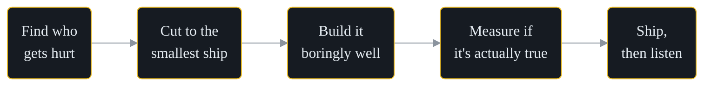

<!--
  DESIGN TOKENS  ·  ink #0D1117  surface #161B22  text #E6EDF3  muted #8B949E  accent #E8B923
  To re-skin the whole profile, swap the accent hex (E8B923) in the URLs below.
-->

<!-- ░░░ HERO ░░░ -->

  

<!-- ░░░ POSITIONING ░░░ -->

  

<!-- ░░░ PROFILE VIEWS + CONTACT ░░░ -->

  
  
  <!-- TODO: add your handles, then uncomment these two lines:
  
  
  -->

 

<!-- ░░░ CURRENTLY ░░░ -->
<table align="center" width="100%">
  <tr>
    <td align="center" width="33%">
      <b>◆ BUILDING</b> 
      Multi-agent misinformation defense
    </td>
    <td align="center" width="33%">
      <b>◆ EXPLORING</b> 
      Agentic RAG · eval pipelines
    </td>
    <td align="center" width="33%">
      <b>◆ OPEN TO</b> 
      AI-for-safety collabs &amp; roles
    </td>
  </tr>
</table>

 

<!-- ░░░ SELECTED WORK ░░░ -->
<h3 align="center">Selected work</h3>

<table align="center" width="100%">
  <tr>
    <td width="33%" valign="top">
      <b><a href="https://github.com/uttampreet-dev/ShadowTrace">ShadowTrace</a></b> 
      Multi-agent system that maps coordinated bot networks behind misinformation campaigns.
    </td>
    <td width="33%" valign="top">
      <b><a href="https://github.com/uttampreet-dev/SheScam">SheScam</a></b> 
      AI scam-detection for women — verify a suspicious message over WhatsApp or web in seconds.
    </td>
    <td width="33%" valign="top">
      <b><a href="https://github.com/uttampreet-dev/codelens-ai">codelens-ai</a></b> 
      RAG + Gemini code explainer: instant explanations, bug detection, and optimizations.
    </td>
  </tr>
</table>

 

<!-- ░░░ HOW I WORK ░░░ -->
<h3 align="center">How I work</h3>

 

<!-- ░░░ STACK ░░░ -->
<h3 align="center">What I build with</h3>

  CRAFT 
  
  
  
  

  INTELLIGENCE 
  
  
  
  

  GROUND 
  
  
  
  

 

<!-- ░░░ PROOF ░░░ -->

  
  

<!-- ░░░ CONTRIBUTION SNAKE (generated by the Action in .github/workflows/snake.yml) ░░░ -->

  

 

<!-- ░░░ CTA ░░░ -->

  Building AI where trust and safety actually matter? <a href="mailto:uttampreetkaur02@gmail.com">Let's talk →</a>

