<!-- ░ dark aesthetic · developer profile ░ -->

  

<!-- ────────────────────────────────────────────────
     HERO GIF SLOT — when you send your lofi coding gif, this becomes:
     

──────────────────────────────────────────────── -->

 

## About Me

I'm an aspiring software developer who loves turning ambitious ideas into real, working products. Most of what I build lives where full-stack engineering meets applied AI — multi-agent systems, retrieval, and tools that actually do something useful. I learn fastest by building, and I care about the small details that make software feel effortless to use.

- **Building** — AI-powered products and multi-agent systems
- **Learning** — systems design, algorithms, and everything full-stack
- **Open to** — internships, collaborations, and open source

 

## Tech Stack

  

 

## Featured Projects

  

  
    <a href="https://github.com/uttampreet-dev/ShadowTrace"><b>ShadowTrace&nbsp;→</b></a>
    &nbsp;&nbsp;·&nbsp;&nbsp;
    <a href="https://github.com/uttampreet-dev/FirstSignal"><b>FirstSignal&nbsp;→</b></a>
  

 

## GitHub Stats

  
  

  

 

## Connect

  
  
  <!-- replace # with your links when ready -->
  
  

 

  

